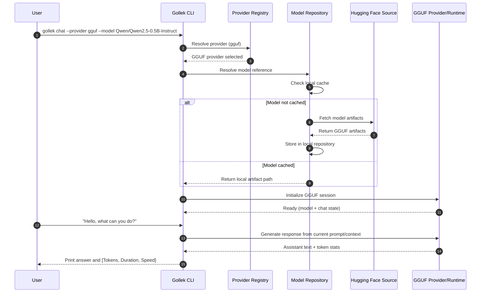

<p class="blog-meta">Published: March 3, 2026</p>

# How Gollek GGUF Chat Loads from Hugging Face and Answers

This post explains what happens when you run:

```bash
gollek chat --provider gguf --model Qwen/Qwen2.5-0.5B-Instruct
```

From the first command, Gollek resolves the model source, pulls artifacts into the local model repository (if needed), initializes the GGUF runtime session, opens interactive prompt mode, and generates the answer.

---

## Example Session

```text
  _____       _  _      _    
 / ____|     | || |    | |   
| |  __  ___ | || | ___| | __
| | |_ |/ _ \| || |/ _ \ |/ /
| |__| | (_) | || |  __/   < 
 \_____|\___/|_||_|\___|_|\_\

Model: Qwen2.5-0.5B-Instruct-GGUF
Provider: gguf
Commands: 'exit' to quit, '/reset' to clear history.
Note: Use '\' at the end of a line for multiline input.
----------------------------------------------------------------------------------------------------

>>> Hello, what can you do?

Assistant: I can help you with coding, writing, and analysis...

[Tokens: 42, Duration: 0.85s, Speed: 49.41 t/s]
```

---

## Process Breakdown

1. CLI parses runtime intent:
- provider is pinned to `gguf`
- model reference is `Qwen/Qwen2.5-0.5B-Instruct`

2. Provider + model resolution:
- Provider registry routes request to GGUF provider path.
- Model repository checks local cache first.
- If missing, repository resolves Hugging Face source and downloads required model artifacts.

3. GGUF session initialization:
- GGUF runtime loads model metadata and tensors.
- Chat runtime prepares initial conversation state and prompt formatting.

4. Interactive prompt loop:
- User input (`>>> ...`) is appended to chat state.
- GGUF provider executes generation with current context.
- Output is streamed/assembled and printed as `Assistant: ...`.

5. Metrics and user feedback:
- CLI prints tokens, duration, and token/s speed.
- Session remains active for next prompt until `exit` or `/reset`.

---

## Sequence Diagram



---

## Why This Matters

- Local-first behavior keeps repeat runs fast after first download.
- Explicit `--provider gguf` gives deterministic runtime path for benchmarking and debugging.
- Interactive loop + token stats make CLI suitable for both demos and performance validation.

---

For related runtime guidance, see [Developer Guidance](/docs/developer-guidance) and [Architecture](/docs/architecture).
