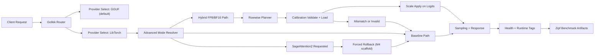

Published: February 28, 2026

# Multi-LoRA and LibTorch Advanced Path Update

This update focuses on production safety and measurable performance work for Multi-LoRA serving, while keeping the default GGUF path stable.

---

## What Shipped

- Multi-LoRA Zipf benchmark harness improvements for reproducible prefill/decode-heavy workload testing.
- Runtime-tag capture from health endpoints now includes advanced mode and FP8 rowwise diagnostics.
- LibTorch hybrid path hardening with FP8 rowwise calibration validation, parsed scale loading, and strict mismatch fallback.
- Calibration lifecycle support with cache, explicit invalidate APIs, and automatic reload when calibration files change.
- SageAttention2 experimental scaffold is now explicitly guarded with safe rollback behavior until kernels are implemented.

---

## Architecture Snapshot

---

## Multi-LoRA Benchmarking Improvements

The benchmark script (`scripts/bench-multilora-zipf.sh`) now captures richer runtime tags when `--health-url` is provided:

- `advanced_effective_enabled`
- `advanced_attention_mode`
- `advanced_reason`
- `advanced_detected_gpu_sm`
- `advanced_fp8_rowwise_active`
- `advanced_fp8_rowwise_reason`
- `advanced_fp8_rowwise_scale_count`
- `advanced_fp8_rowwise_scale_mean`
- `advanced_fp8_rowwise_calibration_source`

This makes it easier to correlate throughput and latency results with the exact runtime mode that produced them.

---

## FP8 Rowwise Safety and Lifecycle

For the LibTorch advanced path:

- FP8 rowwise activation is gated by calibration artifacts and schema checks.
- Row scales are parsed and passed into execution hints.
- Runtime enforces scale-count versus logits-vocab consistency and falls back safely on mismatch.
- Calibration cache now supports controlled invalidation and deterministic reload when calibration files are updated.

---

## SageAttention2 Experimental Guardrail (M4 Entry)

`sage-attention2-enabled` is now treated as an experimental intent flag:

- If requested by itself, runtime falls back to baseline with a clear reason.
- If requested together with implemented advanced modes (for example hybrid FP8/BF16), runtime keeps implemented modes active and rolls back SageAttention2 only.

This keeps rollout risk low while preserving a clear path for future kernel integration.

---

## Documentation Updated

- LibTorch CUDA advanced roadmap status reflects M0-M4 entry progress.
- Kernel architecture notes now include the latest Multi-LoRA and advanced-path implementation status.
- Benchmark docs now include the new runtime-tag fields.
