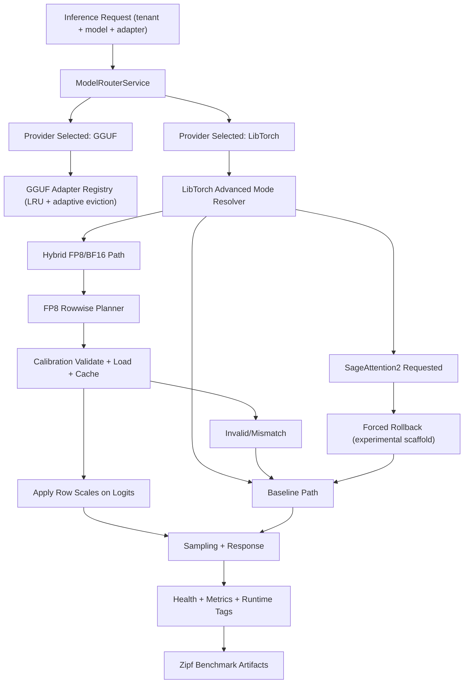

# Gollek Architecture

Deep dive into the Gollek inference engine architecture, components, and design principles.

---

## Overview

Gollek is the inference engine of the Wayang AI platform, designed for high-performance, multi-format AI model inference. It provides a unified abstraction layer over diverse model formats and inference providers.

### Design Goals

- **Unified API** - Single interface for all inference providers
- **Multi-Format Support** - GGUF, ONNX, TFLite, and cloud APIs
- **High Performance** - Reactive, non-blocking architecture
- **Modularity** - Pluggable providers with optional dependencies
- **Native Integration** - GraalVM native image support
- **Enterprise Ready** - Multi-tenancy, quotas, audit logging

---

## System Architecture

```
+------------------------------------------------------------------+
|                        Gollek SDK                                 |
+------------------------------------------------------------------+
|  +------------------+  +------------------+  +----------------+  |
|  | Java API         |  | Native FFI       |  | CDI Extension  |  |
|  | (GollekLocal)    |  | (GraalVM)        |  | (Jakarta EE)   |  |
|  +------------------+  +------------------+  +----------------+  |
+------------------------------------------------------------------+
|                      LocalGollekSdk                               |
|  +----------------+  +----------------+  +---------------------+  |
|  | InferenceSvc   |  | AsyncJobMgr    |  | ProviderRegistry    |  |
|  +----------------+  +----------------+  +---------------------+  |
+------------------------------------------------------------------+
|                     Model Repository                              |
|  +----------------+  +----------------+  +---------------------+  |
|  | Local Models   |  | HuggingFace    |  | S3/Custom Sources   |  |
|  +----------------+  +----------------+  +---------------------+  |
+------------------------------------------------------------------+
|                    Inference Providers                            |
|  +------+  +------+  +--------+  +--------+  +--------+  +-----+ |
|  | GGUF |  | ONNX |  | TFLite |  | OpenAI |  | Gemini |  | ... | |
|  +------+  +------+  +--------+  +--------+  +--------+  +-----+ |
+------------------------------------------------------------------+
```

---

## Core Components

## Advanced Multi-LoRA Runtime Flow



---

### GollekLocalClient

The primary Java API interface exposing all SDK capabilities:

- Completion APIs (sync, async, streaming)
- Async job management
- Batch inference
- Provider and model management
- MCP registry integration

**Location:** `gollek-sdk-java-local/src/main/java/.../GollekLocalClient.java`

---

### LocalGollekSdk

Core implementation of the SDK with CDI integration:

**Key Services:**
| Service | Responsibility |
|---------|---------------|
| InferenceService | Execute inference requests |
| AsyncJobManager | Manage background jobs |
| ProviderRegistry | Provider discovery and lifecycle |
| CachedModelRepository | Model storage and retrieval |
| McpRegistryManager | MCP tool integration |

**Location:** `gollek-sdk-java-local/src/main/java/.../LocalGollekSdk.java`

---

### GollekNativeEntrypoints

GraalVM native image entrypoints with C FFI:

**Lifecycle Functions:**
- `golek_client_create` - Create client instance
- `golek_client_destroy` - Destroy client instance
- `golek_client_shutdown_runtime` - Shutdown runtime
- `golek_string_free` - Free allocated strings

**Inference Functions:**
- `golek_create_completion_json` - Sync inference
- `golek_stream_completion_json` - Streaming inference
- `golek_submit_async_job_json` - Async job submission
- `golek_batch_inference_json` - Batch processing

**Location:** `gollek-sdk-java-local/src/main/java/.../GollekNativeEntrypoints.java`

---

### Provider Registry

Dynamic provider discovery and management:

```
+-------------------+
| ProviderRegistry  |
+-------------------+
        |
        | Discovers via SPI
        v
+-------------------+
| LLMProvider       | <-- OllamaProvider
+-------------------+
| LLMProvider       | <-- OpenAIProvider
+-------------------+
| LLMProvider       | <-- GeminiProvider
+-------------------+
```

**Provider Metadata:**
- Provider ID and name
- Version and vendor
- Capabilities (streaming, async, batch)
- Health status
- Supported models

---

### Model Repository

Unified model storage and retrieval:

**Sources:**
- Local filesystem
- Hugging Face Hub
- S3-compatible storage
- Custom sources via SPI


# Local Runners
- Local runners emitting internal StreamChunks
- OpenAI-compatible SSE JSON can be enable when needed by using flag --enable-json. This adapter layer serializes those chunks as OpenAI-compatible SSE JSON.


**Model Manifest:**
```json
{
    "modelId": "llama-3.2-3b-instruct",
    "name": "Llama 3.2 3B Instruct",
    "version": "1.0",
    "apiKey": "community",
    "artifacts": {
        "gguf": {
            "path": "/models/llama-3.2-3b.gguf",
            "sizeBytes": 2147483648
        }
    },
    "metadata": {
        "quantization": "Q4_K_M",
        "sizeBytes": 2147483648
    },
    "createdAt": "2024-01-01T00:00:00Z",
    "updatedAt": "2024-01-01T00:00:00Z"
}
```

---

## Inference Flow

### Synchronous Inference

```
1. Client creates InferenceRequest
         |
         v
2. GollekLocalClient.createCompletion()
         |
         v
3. LocalGollekSdk.enrichRequest()
   (Add preferred provider if not set)
         |
         v
4. InferenceService.inferAsync()
         |
         v
5. ProviderRegistry.resolveProvider()
         |
         v
6. ModelRepository.resolveModel()
         |
         v
7. Provider.execute(model, request)
         |
         v
8. Return InferenceResponse
```

---

### Streaming Inference

```
1. Client creates InferenceRequest
         |
         v
2. GollekLocalClient.streamCompletion()
         |
         v
3. InferenceService.inferStream()
         |
         v
4. Provider.stream(model, request)
         |
         v
5. Multi<StreamChunk> emitted
         |
         v
6. Client subscribes to stream
         |
         v
7. Tokens delivered in real-time
```

---

### Async Job Flow

```
1. Client submits InferenceRequest
         |
         v
2. AsyncJobManager.submitJob()
         |
         v
3. Job queued with unique ID
         |
         v
4. Background executor processes job
         |
         v
5. Status updated: PENDING -> RUNNING -> COMPLETED
         |
         v
6. Client polls or waits for completion
         |
         v
7. Result retrieved via getJobStatus()
```

---

## Multi-Tenancy

Gollek supports multi-tenancy via the `tenant-gollek-ext` extension:

### Features

- **Tenant-scoped quotas** - Rate limits per tenant
- **Isolated model pools** - Dedicated model instances
- **Secure credential management** - Per-tenant API keys
- **Audit trail** - Comprehensive logging with provenance

### Activation

```bash
# Enable multi-tenancy
export WAYANG_MULTITENANCY_ENABLED=true

# Configure tenant
export GOLLEK_TENANT_ID=tenant-123
export GOLLEK_TENANT_API_KEY=sk-tenant-...
```

---

## Model Download and Persistence

### Download Flow

```
Model Request
      |
      v
{ Model in Repository? }
      |
      +-- Yes --> Load from Cache --> Ready
      |
      +-- No --> { Offline Mode? }
                    |
                    +-- Yes --> { GGUF Variant Exists? }
                    |               |
                    |               +-- Yes --> Use GGUF
                    |               +-- No --> Error
                    |
                    +-- No --> Download from Source
                                |
                                v
                        Download with Progress
                                |
                                v
                        Register in Repository
                                |
                                v
                        Save ModelManifest
                                |
                                v
                            Ready
```

### Key Features

**Persistence:**
- Downloaded models registered with LocalModelRepository
- ModelManifest created with artifact location
- No re-downloads on subsequent runs

**Progress Tracking:**
- Real-time download progress callbacks
- Graceful interrupt handling
- Partial download cleanup

---

## Extension Points

### Provider SPI

Implement custom inference providers:

```java
public interface LLMProvider {
    String id();
    String name();
    ProviderMetadata metadata();
    Set<ProviderCapability> capabilities();
    
    Uni<InferenceResponse> infer(InferenceRequest request);
    Multi<StreamChunk> stream(InferenceRequest request);
    Uni<ProviderHealth> health();
}
```

### Model Repository SPI

Implement custom model sources:

```java
public interface ModelRepository {
    Uni<ModelManifest> findById(String modelId, String apiKey);
    Uni<List<ModelManifest>> list(String apiKey, Pageable pageable);
    Uni<Void> delete(String modelId, String apiKey);
}
```

---

## Technology Stack

| Component | Technology |
|-----------|------------|
| Framework | Quarkus 3.x |
| Language | Java 21 |
| Reactive | SmallRye Mutiny |
| CDI | Jakarta EE 10 |
| JSON | Jackson |
| Native Image | GraalVM 24.1 |
| Build | Maven |

---

## Module Dependencies

```
gollek-sdk-java-local
├── gollek-sdk-core (SPI interfaces)
├── gollek-spi (Provider SPI)
├── gollek-engine (Inference service)
├── gollek-model-repo-core (Model repository)
├── gollek-model-repo-hf (HuggingFace source)
├── gollek-model-repo-local (Local filesystem)
├── gollek-ext-format-gguf (GGUF support)
├── gollek-plugin-mcp (MCP integration)
├── mutiny (Reactive programming)
├── jakarta.enterprise.cdi-api (CDI)
├── jackson (JSON)
└── graalvm.nativeimage (Native FFI)
```

---

## Performance Considerations

### Memory Management

- Native images reduce heap requirements
- Streaming avoids buffering large responses
- Model lazy-loading minimizes initial memory

### Concurrency

- Non-blocking I/O throughout
- Reactive streams for backpressure
- Thread-local error state in native mode

### Caching

- Model metadata cached after first load
- Optional response caching for repeated prompts
- Connection pooling for cloud providers

---

## Security

### Credential Management

- API keys via environment variables
- Tenant-scoped credentials
- Secure credential injection

### Isolation

- ClassLoader isolation for plugins
- Optional WASM sandboxing
- Container-based isolation (enterprise)

### Audit

- Comprehensive request/response logging
- Provenance tracking for outputs
- Compliance hooks for regulations

---

## Observability

### Metrics

- Request latency histograms
- Token usage counters
- Provider health gauges
- Queue depth monitors

### Tracing

- OpenTelemetry integration
- Distributed trace propagation
- Span annotations for key operations

### Logging

- Structured JSON logging
- Correlation IDs for requests
- Configurable log levels

---

## SageAttention2 Configuration

SageAttention2 is configurable, but currently guarded as an experimental path with rollback safety.

### Core Flags

| Key | Purpose |
|-----|---------|
| `libtorch.provider.advanced.sage-attention2-enabled` | Enable/disable SageAttention2 intent |
| `libtorch.provider.advanced.sage-attention2-allowed-tenants` | Optional tenant allow-list for canary scope |
| `libtorch.provider.advanced.sage-attention2-allowed-models` | Optional model allow-list for canary scope |
| `libtorch.provider.advanced.sage-attention2-blocked-tenants` | Optional tenant deny-list (takes precedence) |
| `libtorch.provider.advanced.sage-attention2-blocked-models` | Optional model deny-list (takes precedence) |

### Environment Variables

- `LIBTORCH_ADVANCED_SAGE2_ENABLED`
- `LIBTORCH_ADVANCED_SAGE2_ALLOWED_TENANTS`
- `LIBTORCH_ADVANCED_SAGE2_ALLOWED_MODELS`
- `LIBTORCH_ADVANCED_SAGE2_BLOCKED_TENANTS`
- `LIBTORCH_ADVANCED_SAGE2_BLOCKED_MODELS`

### Canary Precedence

1. Deny-list check (`blocked-*`)
2. Allow-list check (`allowed-*`)
3. Resolver rollback reason (for example `not-implemented`)

### Current Runtime Status

- SageAttention2 is still rollback-only (no kernel execution path active yet).
- Runtime exposes requested/active/reason state via health and benchmark runtime tags (`advanced_sage_attention2_*`).

## FP8 Rowwise Canary Configuration

FP8 rowwise is configurable with canary allow/deny controls.

### Core Flags

| Key | Purpose |
|-----|---------|
| `libtorch.provider.advanced.fp8-rowwise-enabled` | Enable/disable FP8 rowwise path |
| `libtorch.provider.advanced.fp8-rowwise-allowed-tenants` | Optional tenant allow-list for canary scope |
| `libtorch.provider.advanced.fp8-rowwise-allowed-models` | Optional model allow-list for canary scope |
| `libtorch.provider.advanced.fp8-rowwise-blocked-tenants` | Optional tenant deny-list (takes precedence) |
| `libtorch.provider.advanced.fp8-rowwise-blocked-models` | Optional model deny-list (takes precedence) |

### Environment Variables

- `LIBTORCH_ADVANCED_FP8_ROWWISE_ENABLED`
- `LIBTORCH_ADVANCED_FP8_ROWWISE_ALLOWED_TENANTS`
- `LIBTORCH_ADVANCED_FP8_ROWWISE_ALLOWED_MODELS`
- `LIBTORCH_ADVANCED_FP8_ROWWISE_BLOCKED_TENANTS`
- `LIBTORCH_ADVANCED_FP8_ROWWISE_BLOCKED_MODELS`

### Canary Precedence

1. Deny-list check (`blocked-*`)
2. Allow-list check (`allowed-*`)
3. Calibration planner checks (artifact/schema/load/runtime match)

### Current Runtime Status

- FP8 rowwise remains feature-flagged and calibration-gated.
- Runtime exposes requested/active/reason plus scale metadata via health and benchmark tags (`advanced_fp8_rowwise_*`).

## Multi-LoRA Benchmark Telemetry

`scripts/bench-multilora-zipf.sh` now supports optional host/GPU telemetry so CPU/GPU efficiency can be compared across providers and deployment modes.

### Flags

- `--advanced-profile`: `baseline|hybrid-fp8-bf16|sageattention2-intent` for explicit benchmark intent segmentation.
- `--telemetry`: `auto|on|off` for host metrics collection.
- `--gpu-telemetry`: `auto|on|off` for GPU metrics collection (`nvidia-smi` required).
- `--sample-interval-sec`: sample interval (default `1` second).

### Artifacts

- `telemetry.csv`: timestamped samples for load, memory, and GPU utilization/memory.
- `telemetry-summary.txt`: reduced metrics that are merged into `summary.txt` and `summary.json`.
- `report.txt` / `report.json` from `scripts/bench-compare.sh` for baseline-vs-candidate KPI deltas.

### Summary Fields

- `host_load_1_avg`
- `host_mem_used_mb_avg`
- `host_mem_used_mb_peak`
- `gpu_util_avg`
- `gpu_util_p95`
- `gpu_mem_used_mb_peak`

### Comparison Workflow

1. Run `bench-multilora-zipf.sh` with `--advanced-profile baseline`.
2. Run candidate profiles (`hybrid-fp8-bf16`, `sageattention2-intent`).
3. Run `bench-compare.sh` to generate a normalized delta report.

### Configuration Snippets

`application.properties`:

```properties
libtorch.provider.advanced.fp8-rowwise-enabled=true
libtorch.provider.advanced.fp8-rowwise-allowed-tenants=tenant-a,tenant-b
libtorch.provider.advanced.fp8-rowwise-allowed-models=llama-3-8b,qwen2.5-7b
libtorch.provider.advanced.fp8-rowwise-blocked-tenants=tenant-suspended
libtorch.provider.advanced.fp8-rowwise-blocked-models=legacy-model

libtorch.provider.advanced.sage-attention2-enabled=true
libtorch.provider.advanced.sage-attention2-allowed-tenants=tenant-a,tenant-b
libtorch.provider.advanced.sage-attention2-allowed-models=llama-3-8b,qwen2.5-7b
libtorch.provider.advanced.sage-attention2-blocked-tenants=tenant-suspended
libtorch.provider.advanced.sage-attention2-blocked-models=legacy-model
```

`application.yaml`:

```yaml
libtorch:
  provider:
    advanced:
      fp8-rowwise-enabled: true
      fp8-rowwise-allowed-tenants: tenant-a,tenant-b
      fp8-rowwise-allowed-models: llama-3-8b,qwen2.5-7b
      fp8-rowwise-blocked-tenants: tenant-suspended
      fp8-rowwise-blocked-models: legacy-model

      sage-attention2-enabled: true
      sage-attention2-allowed-tenants: tenant-a,tenant-b
      sage-attention2-allowed-models: llama-3-8b,qwen2.5-7b
      sage-attention2-blocked-tenants: tenant-suspended
      sage-attention2-blocked-models: legacy-model
```

### Recommended Rollout Sequence

1. **Dev only**: set `sage-attention2-enabled=true` with a single test tenant/model in allow-lists.
2. **Canary small**: expand allow-lists to a few low-risk tenants/models; keep deny-lists ready for fast exclusion.
3. **Canary broad**: widen allow-lists gradually while monitoring `advanced_sage_attention2_*` runtime tags.
4. **Instant rollback**: set `sage-attention2-enabled=false` (global), or add specific tenants/models to deny-lists.

---

[Back to Native FFI](/docs/native-ffi) &nbsp; [Examples](/docs/examples)
