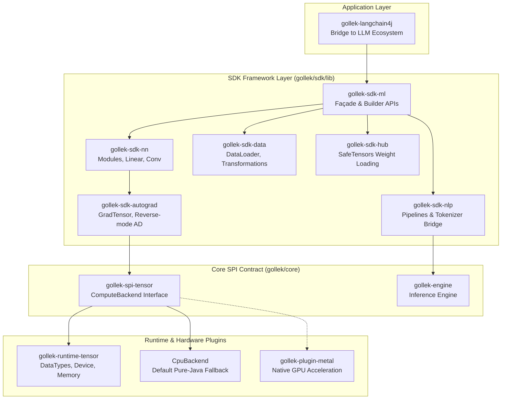
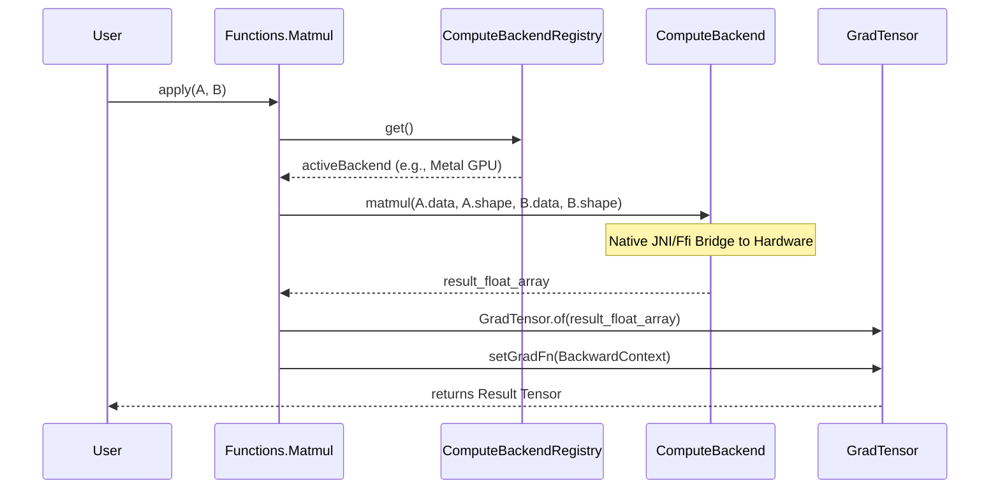
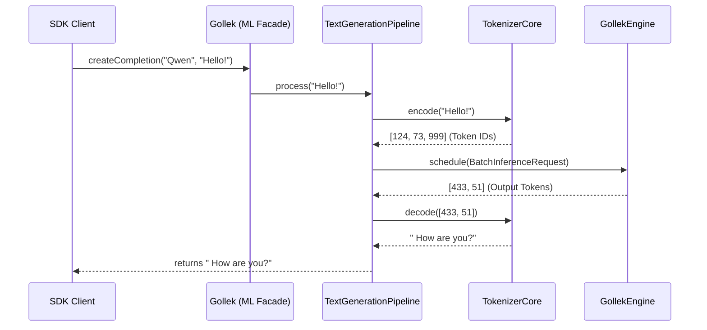

# Gollek Architecture Diagrams

This document outlines the high-level architecture, module dependencies, and the kernel dispatch sequence of the Gollek platform.

## 1. High-Level Modular Architecture

The Gollek platform follows a strict layered architecture, decoupling high-level framework features (like Neural Networks and Autograd) from low-level memory management and hardware acceleration.

```mermaid
graph TD
    subgraph "Application Layer"
        Langchain[gollek-langchain4j<br/>Bridge to LLM Ecosystem]
    end

    subgraph "SDK Framework Layer (gollek/sdk/lib)"
        ML[gollek-sdk-ml<br/>Façade & Builder APIs]
        NLP[gollek-sdk-nlp<br/>Pipelines & Tokenizer Bridge]
        NN[gollek-sdk-nn<br/>Modules, Linear, Conv]
        Data[gollek-sdk-data<br/>DataLoader, Transformations]
        Hub[gollek-sdk-hub<br/>SafeTensors Weight Loading]
        Autograd[gollek-sdk-autograd<br/>GradTensor, Reverse-mode AD]
        
        Langchain --> ML
        ML --> NLP
        ML --> NN
        ML --> Data
        ML --> Hub
        NN --> Autograd
    end

    subgraph "Core SPI Contract (gollek/core)"
        SPITensor[gollek-spi-tensor<br/>ComputeBackend Interface]
        Autograd --> SPITensor
        NLP --> Engine[gollek-engine<br/>Inference Engine]
    end

    subgraph "Runtime & Hardware Plugins"
        Runtime[gollek-runtime-tensor<br/>DataTypes, Device, Memory]
        CPU[CpuBackend<br/>Default Pure-Java Fallback]
        Metal[gollek-plugin-metal<br/>Native GPU Acceleration]
        
        SPITensor --> CPU
        SPITensor -.-> Metal
        SPITensor --> Runtime
    end
```

## 2. Kernel Dispatch Sequence (Autograd)

When an operation (e.g., matrix multiplication) is performed on a `GradTensor`, the operation delegates to the `ComputeBackendRegistry`, which routes it to the highest priority hardware plugin available (e.g., Metal).

```mermaid
sequenceDiagram
    participant User
    participant Func as Functions.Matmul
    participant Reg as ComputeBackendRegistry
    participant SPI as ComputeBackend
    participant Tensor as GradTensor

    User->>Func: apply(A, B)
    Func->>Reg: get()
    Reg-->>Func: activeBackend (e.g., Metal GPU)
    Func->>SPI: matmul(A.data, A.shape, B.data, B.shape)
    
    Note over SPI: Native JNI/Ffi Bridge to Hardware
    SPI-->>Func: result_float_array
    
    Func->>Tensor: GradTensor.of(result_float_array)
    Func->>Tensor: setGradFn(BackwardContext)
    Tensor-->>User: returns Result Tensor
```

## 3. NLP Inference Sequence

How the SDK bridges text generation through the underlying tokenizer and LLM inference engine.

```mermaid
sequenceDiagram
    participant Client as SDK Client
    participant Facade as Gollek (ML Facade)
    participant Pipe as TextGenerationPipeline
    participant Tok as TokenizerCore
    participant Eng as GollekEngine
    
    Client->>Facade: createCompletion("Qwen", "Hello!")
    Facade->>Pipe: process("Hello!")
    
    Pipe->>Tok: encode("Hello!")
    Tok-->>Pipe: [124, 73, 999] (Token IDs)
    
    Pipe->>Eng: schedule(BatchInferenceRequest)
    Eng-->>Pipe: [433, 51] (Output Tokens)
    
    Pipe->>Tok: decode([433, 51])
    Tok-->>Pipe: " How are you?"
    
    Pipe-->>Client: returns " How are you?"
```
