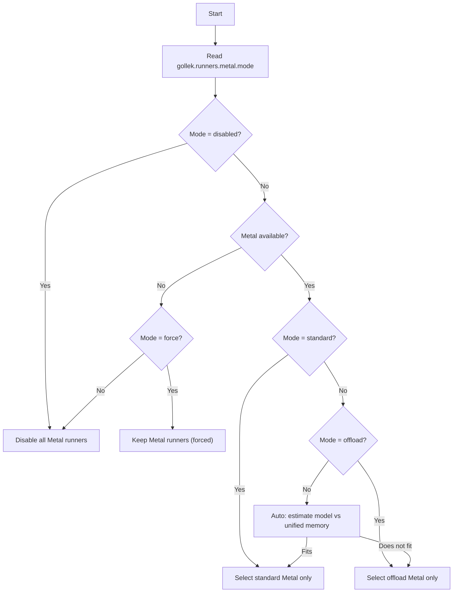

# Developer Guidance

Operational guidance for benchmarking, CI gates, and rollout safety.

---

## Latest Strict Gate Status

<section class="subtle-panel gate-status-panel" id="gate-status-panel">
  <div class="gate-status-head">
    <strong>Latest strict matrix:</strong>
    <span class="gate-pill gate-pill-unknown" id="gate-status-pill">UNKNOWN</span>
  </div>
  <div class="gate-status-meta" id="gate-status-meta">Loading latest gate summary…</div>
  <div class="gate-status-metrics" id="gate-status-metrics"></div>
</section>

---

## Benchmark Workflow

Use three profiles consistently:

1. `baseline`
2. `hybrid-fp8-bf16`
3. `sageattention2-intent`

Run with:
- `bench-multilora-zipf.sh` for a single profile
- `bench-matrix-advanced.sh` for full matrix + gate evaluation
- `bench-compare.sh` for baseline-vs-candidate delta reports

---

## CI Modes

1. Smoke (`bench-matrix-smoke.yml`)
- deterministic mock-backed check
- safe default for PR merge protection

2. Strict (`bench-matrix-strict.yml`)
- manual run against real endpoints
- preferred before release cut
- emits trend artifacts (`trends/matrix-gates.csv`, `trends/matrix-gates.json`) in each run
- emits gate alert artifacts (`gate-alert.txt`, `gate-alert.md`) in each run
- can send optional webhook alert on failure (`GOLEK_BENCH_ALERT_WEBHOOK`)

---

## Gate Guidance

Default hybrid gate targets:
- throughput uplift: `>= 20%` (`req/s` or `tokens/s`)
- latency p95 regression: `<= 10%`
- absolute error-rate regression: `<= 0.005`

Runtime-tag policy:
- `--runtime-tag-gate auto|on|off`
- recommended: `on` for strict runs, `auto` for mixed environments

---

## Metal Runner Modes (Apple Silicon)

Metal runners are controlled with a single mode flag that supports auto-detect and manual forcing:

```properties
gollek.runners.metal.enabled=true
gollek.runners.metal-offload.enabled=true
gollek.runners.metal.mode=auto  # auto|standard|offload|force|disabled
```

Behavior:
- `auto`: detect availability and pick standard vs offload based on model size vs unified memory
- `standard`: force the in-memory Metal runner
- `offload`: force the weight-offload runner
- `force`: keep Metal runners active even when detection fails
- `disabled`: remove Metal runners from selection

Configuration sources:
- `gollek.runners.metal.mode` via `GOLLEK_METAL_MODE` env var
- `gollek.runners.metal.enabled` via `GOLLEK_METAL_ENABLED` env var
- `gollek.runners.metal-offload.enabled` via `GOLLEK_METAL_OFFLOAD_ENABLED` env var

Engine device preference (routing defaults):
- `gollek.engine.device.preference=auto|metal|cuda|cpu|none` (default: `auto`)
- `auto` sets `preferredDevice=METAL` on Apple Silicon, otherwise no preference
- Request override (default on): `device=metal|cuda|cpu|rocm|tpu|npu` in request parameters
- Disable request overrides: `gollek.engine.device.preference.allow-request-override=false`

Runner auto-Metal toggles:
- GGUF: `gguf.provider.gpu.auto-metal=true` and `gguf.provider.gpu.auto-metal.layers=-1`
- LiteRT: `litert.provider.gpu.auto-metal=true`
- LibTorch: `libtorch.provider.gpu.auto-mps-enabled=true`
- ONNX Runtime: `onnx.runner.execution_provider=coreml` (Apple Silicon CoreML EP)
- Global Metal switches (`gollek.runners.metal.enabled=false` or `gollek.runners.metal.mode=disabled`) also disable ONNX CoreML.

Diagnostics:
- Auto mode will skip offload when the model fits unified memory.
- Force mode keeps Metal runners active even if detection reports unavailable.
- If Metal is unavailable and mode is not `force`, the Metal runners are removed from selection.
- Build/install note: `make -C inference-gollek/extension/kernel/gollek-kernel-metal/src/main/cpp/metal install`
  copies `libgollek_metal.dylib` to `~/.gollek/libs/` (and resources for packaging).

Decision flow (auto + manual):



Example logs:

```text
INFO  [MetalRunner] Metal runner enabled (mode=auto, metalAvailable=true)
INFO  [MetalWeightOffloadingRunner] Metal offload skipped (auto) — model fits in unified memory
```

GPU smoke test (Apple Silicon only):
- Opt-in by setting `-Dgollek.metal.tests=true`
- Optional strict mode: `-Dgollek.metal.tests.strict=true` (fails on Metal init errors instead of skipping)
- Provide the dylib path via `-Dgollek.metal.library-path=/path/to/libgollek_metal.dylib`,
  `-Dgollek.runners.metal.library-path=...`, or `GOLLEK_METAL_LIBRARY_PATH`
- Default search paths: `~/.gollek/libs/libgollek_metal.dylib`, `/usr/local/lib/libgollek_metal.dylib`, `/Library/Gollek/libgollek_metal.dylib`
- The test skips automatically if Metal is unavailable or the dylib is missing
- Headless CI can report `No Metal device found`; run on a logged-in desktop session for GPU validation.
- CI/profile shortcut: `mvn -f inference-gollek/extension/kernel/gollek-kernel-metal/pom.xml -Pmetal-gpu-tests test`
- JVM note: the profile sets `--enable-native-access=ALL-UNNAMED` to satisfy FFM access.

Troubleshooting checklist:
- Metal not selected: confirm `gollek.runners.metal.enabled=true` and the device is Apple Silicon.
- Metal unavailable in logs: set `gollek.runners.metal.mode=force` to test manual override.
- Offload never used: try a larger model or set `gollek.runners.metal.mode=offload`.
- Unexpected CPU fallback: verify other runners are enabled and the Metal mode is not `disabled`.
- `No Metal device found`: run tests in a logged-in desktop session (headless CI may not expose Metal).

Build note:
- If you see `class not found` errors after moving SPI types, run a clean build to clear stale reactor output: `mvn -f inference-gollek/pom.xml clean install`.

---

## Failure Triage

When matrix fails:

1. Open `gate-summary.txt` first.
2. Map failure to gate type:
- throughput
- latency
- error
- SA2 runtime tag
3. Use `compare/report.txt` and `results.csv` to isolate impact.
4. Roll back to baseline flags if regression is user-visible.

Update website badge data after strict run:

```bash
./scripts/publish-latest-gate-summary.sh \
  --gate-json /path/to/strict-run/gate-summary.json \
  --output ../website/gollek-ai.github.io/assets/data/latest-gate-summary.json
```

---

## Trend Tracking

Generate trend snapshots:

```bash
./scripts/bench-trend-snapshot.sh \
  --matrix-root ops/benchmarks/matrix \
  --out-csv ops/benchmarks/trends/matrix-gates.csv \
  --out-json ops/benchmarks/trends/matrix-gates.json \
  --limit 100
```

Use the CSV for quick review and JSON for automation.
In strict CI, this snapshot is generated automatically; use manual script runs for local/offline aggregation.

---

[Back to Docs Index](/docs/) &nbsp; [Architecture](/docs/architecture)

<script>
  (function () {
    const pill = document.getElementById('gate-status-pill');
    const meta = document.getElementById('gate-status-meta');
    const metrics = document.getElementById('gate-status-metrics');
    if (!pill || !meta || !metrics) return;

    fetch('/assets/data/latest-gate-summary.json', { cache: 'no-store' })
      .then((res) => {
        if (!res.ok) throw new Error('status file not available');
        return res.json();
      })
      .then((data) => {
        const status = data.gate_status === 'PASS' ? 'PASS' : (data.gate_status === 'FAIL' ? 'FAIL' : 'UNKNOWN');
        pill.textContent = status;
        pill.classList.remove('gate-pill-unknown', 'gate-pill-pass', 'gate-pill-fail');
        pill.classList.add(status === 'PASS' ? 'gate-pill-pass' : status === 'FAIL' ? 'gate-pill-fail' : 'gate-pill-unknown');

        const matrixName = data.matrix_name || 'unknown';
        const generatedAt = data.generated_at_utc || 'unknown';
        meta.textContent = `Matrix: ${matrixName} | Generated: ${generatedAt}`;

        const req = data.hybrid_req_delta_pct ?? 'n/a';
        const tok = data.hybrid_tokens_delta_pct ?? 'n/a';
        const lat = data.hybrid_latency_p95_delta_pct ?? 'n/a';
        const err = data.hybrid_error_delta_abs ?? 'n/a';
        metrics.textContent = `req_delta=${req}% · tok_delta=${tok}% · lat_p95_delta=${lat}% · err_delta=${err}`;
      })
      .catch(() => {
        pill.textContent = 'UNKNOWN';
        pill.classList.remove('gate-pill-pass', 'gate-pill-fail');
        pill.classList.add('gate-pill-unknown');
        meta.textContent = 'Latest gate summary not published yet.';
        metrics.textContent = 'Publish /assets/data/latest-gate-summary.json from strict run artifacts.';
      });
  })();
</script>
