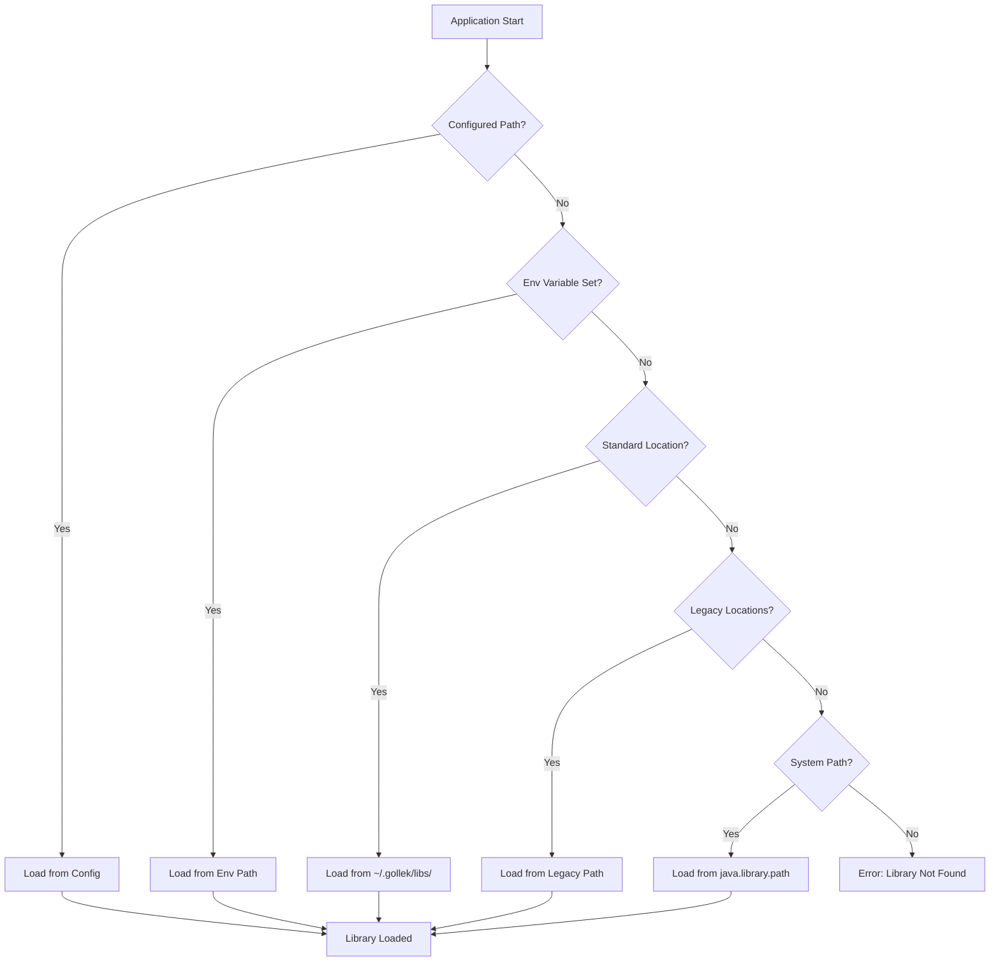

# Native Library Management Guide

{: .highlight }
**Comprehensive guide** for managing native inference libraries in Gollek SDK.

## Overview

Gollek uses a **standardized native library location** at `~/.gollek/libs/` for all inference engine native libraries. This provides centralized management across all runners and platforms.

### Supported Runners

| Runner | Library | Standard Location |
|--------|---------|-------------------|
| **GGUF** | llama.cpp | `~/.gollek/libs/llama/` |
| **ONNX** | ONNX Runtime | `~/.gollek/libs/onnxruntime/` |
| **LibTorch** | PyTorch | `~/.gollek/libs/libtorch/` |
| **TFLite** | TensorFlow Lite | `~/.gollek/libs/litert/` |
| **Metal** | Metal Kernels | `~/.gollek/libs/metal/` |
| **Tokenizer** | SentencePiece Bridge | `~/.gollek/libs/native/` |

---

## Architecture

### Library Loading Flow



### Directory Structure

```
~/.gollek/
├── libs/                      # Standard library location
│   ├── llama/                 # GGUF runner
│   │   ├── libllama.dylib
│   │   ├── libggml.dylib
│   │   ├── libggml-base.dylib
│   │   ├── libggml-cpu.dylib
│   │   └── libggml-metal.dylib
│   │
│   ├── onnxruntime/           # ONNX runner
│   │   ├── libonnxruntime.dylib
│   │   └── libonnxruntime.1.19.2.dylib
│   │
│   ├── libtorch/              # PyTorch runner
│   │   ├── libtorch.dylib
│   │   ├── libtorch_cpu.dylib
│   │   ├── libc10.dylib
│   │   └── libomp.dylib
│   │
│   ├── litert/                # TFLite runner
│   │   └── libtensorflowlite.dylib
│   │
│   └── native/                # Shared native bridges
│       └── libspm_bridge.dylib
│
└── source/                    # Source/vendor libraries (legacy)
    └── vendor/
        ├── llama.cpp/
        ├── onnxruntime/
        └── libtorch/
```

---

## Installation

### Quick Install (Recommended)

```bash
# Install all native libraries
make -f Makefile.native install-native-libs

# Verify installation
make -f Makefile.native verify-libs
```

### Platform-Specific Installation

#### macOS (Apple Silicon)

```bash
# GGUF / llama.cpp
make -f Makefile.native install-gguf-libs

# ONNX Runtime
make -f Makefile.native install-onnx-libs

# LibTorch
make -f Makefile.native install-libtorch-libs

# Clear macOS quarantine
xattr -dr com.apple.quarantine ~/.gollek/libs/
```

#### Linux

```bash
# Install all libraries
make -f Makefile.native install-native-libs

# Set permissions
chmod +x ~/.gollek/libs/*/*.so
```

#### Windows

```powershell
# Install all libraries
make -f Makefile.native install-native-libs

# Verify
dir $env:USERPROFILE\.gollek\libs\
```

---

## Configuration

### Environment Variables

#### Base Configuration

```bash
# Override default library directory
export GOLLEK_NATIVE_LIB_DIR=/opt/gollek/libs

# Per-runner overrides
export GOLLEK_LLAMA_LIB_DIR=~/.gollek/libs/llama
export GOLLEK_ONNX_LIB_DIR=~/.gollek/libs/onnxruntime
export GOLLEK_LIBTORCH_SOURCE_DIR=~/.gollek/source/vendor/libtorch
```

#### Explicit Library Paths

```bash
# Specific library file paths
export GOLLEK_LLAMA_LIB_PATH=~/.gollek/libs/llama/libllama.dylib
export GOLLEK_ONNX_LIB_PATH=~/.gollek/libs/onnxruntime/libonnxruntime.dylib
```

### Application Properties

```properties
# GGUF Provider Configuration
gguf.provider.native.library-path=~/.gollek/libs/llama/libllama.dylib
gguf.provider.native.library-dir=~/.gollek/libs/llama/

# ONNX Runner Configuration
gollek.runners.onnx.library-path=~/.gollek/libs/onnxruntime/libonnxruntime.dylib

# LibTorch Configuration
libtorch.provider.native.library-path=~/.gollek/libs/libtorch/libtorch.dylib
```

### Priority Order

Configuration sources are checked in this order:

1. **Explicit Configuration** - `native.library-path` in properties
2. **Environment Variables** - `GOLLEK_*_LIB_PATH`
3. **Standard Location** - `~/.gollek/libs/<runner>/`
4. **Legacy Locations** - `~/.gollek/source/vendor/`, `~/.gollek/native-libs/`
5. **System Library Path** - `java.library.path`
6. **Build Directories** - `target/`, `build/`, `cmake-build-*/`

---

## Programmatic Usage

### Using NativeLibraryManager

```java
import tech.kayys.gollek.core.util.NativeLibraryManager;

// Initialize manager for llama.cpp
NativeLibraryManager llamaManager = new NativeLibraryManager("llama");

// Get library directory
Path libDir = llamaManager.getLibraryDirectory();
// Returns: ~/.gollek/libs/llama/

// Get expected library file path
Path libPath = llamaManager.getLibraryFilePath();
// Returns: ~/.gollek/libs/llama/libllama.dylib

// Copy library from build directory
Path sourceLib = Path.of("build/lib/libllama.dylib");
Path installedPath = llamaManager.copyToStandardLocation(sourceLib);

// Load library
boolean loaded = llamaManager.loadLibrary();

// Check if library exists
boolean exists = llamaManager.libraryExists();
```

### Copying Multiple Libraries

```java
import tech.kayys.gollek.core.util.NativeLibraryManager;

NativeLibraryManager manager = new NativeLibraryManager("llama");

// Copy multiple libraries at once
List<String> libraries = List.of(
    "llama", "ggml", "ggml-base", "ggml-cpu", "ggml-metal"
);

Path sourceDir = Path.of("build/lib");
List<Path> installedPaths = manager.copyLibrariesToStandardLocation(
    sourceDir, 
    libraries
);
```

### Platform-Aware Loading

```java
import tech.kayys.gollek.core.util.NativeLibraryManager;

// Get platform-specific extension
String ext = NativeLibraryManager.getNativeExtension();
// macOS: ".dylib"
// Linux: ".so"
// Windows: ".dll"

// Clear macOS quarantine
NativeLibraryManager.clearMacQuarantine(
    Path.of("~/.gollek/libs/llama")
);

// Load library with error handling
try {
    boolean loaded = NativeLibraryManager.loadLibrary(libPath);
    if (!loaded) {
        log.error("Failed to load library: " + libPath);
    }
} catch (UnsatisfiedLinkError e) {
    log.error("Library load failed", e);
}
```

---

## Runner-Specific Configuration

### GGUF Runner (llama.cpp)

```java
// LlamaCppBinding automatically searches ~/.gollek/libs/llama/
GGUFProviderConfig config = GGUFProviderConfig.builder()
    .nativeLibraryDir(Optional.of("~/.gollek/libs/llama/"))
    .build();

GGUFProvider provider = new GGUFProvider(config);
provider.initialize();
```

**Search Order:**
1. `GOLLEK_LLAMA_LIB_PATH` environment variable
2. `GOLLEK_LLAMA_LIB_DIR` environment variable
3. `~/.gollek/libs/llama/` (standard location)
4. `~/.gollek/native-libs/` (legacy)
5. `~/.gollek/source/vendor/llama.cpp/build/bin/`
6. Build directories (`target/`, `build/`)

### ONNX Runner

```java
// OnnxRuntimeRunner automatically searches ~/.gollek/libs/onnxruntime/
OnnxRuntimeRunner runner = new OnnxRuntimeRunner();
runner.initialize(modelManifest, runnerConfig);
```

**Search Order:**
1. `GOLLEK_ONNX_LIB_PATH` environment variable
2. `~/.gollek/libs/onnxruntime/libonnxruntime.dylib`
3. `~/.gollek/libs/libonnxruntime.dylib` (legacy)
4. Build directories

### LibTorch Runner

```java
// NativeLibraryLoader automatically searches ~/.gollek/libs/libtorch/
SymbolLookup lookup = NativeLibraryLoader.load(
    Optional.of("~/.gollek/libs/libtorch/")
);
```

**Search Order:**
1. Configured path (`libtorch.provider.native.library-path`)
2. `LIBTORCH_PATH` environment variable
3. `~/.gollek/libs/libtorch/` (standard location)
4. `~/.gollek/source/vendor/libtorch/`
5. System library path

---

## Troubleshooting

### Diagnostic Commands

```bash
# Check library installation
ls -lh ~/.gollek/libs/*/

# Verify library format (macOS)
file ~/.gollek/libs/llama/libllama.dylib
# Expected: Mach-O 64-bit dynamically linked shared library arm64

# Check dependencies (macOS)
otool -L ~/.gollek/libs/llama/libllama.dylib

# Check dependencies (Linux)
ldd ~/.gollek/libs/llama/libllama.so

# Verify permissions
ls -l ~/.gollek/libs/llama/
# Expected: -rwxr-xr-x for .dylib/.so files

# Check quarantine (macOS)
xattr -l ~/.gollek/libs/llama/libllama.dylib
```

### Common Issues

#### Library Not Found

**Symptoms:**
```
Native library not found at ~/.gollek/libs/llama/libllama.dylib
```

**Solutions:**

1. **Verify installation**
   ```bash
   ls -lh ~/.gollek/libs/llama/
   make -f Makefile.native install-gguf-libs
   ```

2. **Set explicit path**
   ```bash
   export GOLLEK_LLAMA_LIB_PATH=~/.gollek/libs/llama/libllama.dylib
   ```

3. **Check permissions**
   ```bash
   chmod +x ~/.gollek/libs/llama/*.dylib
   ```

#### UnsatisfiedLinkError

**Symptoms:**
```
java.lang.UnsatisfiedLinkError: dlopen: library not loaded
```

**Solutions:**

1. **Check dependencies**
   ```bash
   otool -L ~/.gollek/libs/llama/libllama.dylib
   # Ensure all dependent libraries are present
   ```

2. **Load dependencies first**
   ```bash
   # Ensure libggml, libggml-base, etc. are in same directory
   ls ~/.gollek/libs/llama/
   ```

3. **Enable debug logging**
   ```bash
   java -Dgollek.logging.level=DEBUG -jar gollek.jar
   ```

#### macOS Quarantine

**Symptoms:**
```
Library not loaded: cannot load file
code signature invalid
```

**Solution:**
```bash
# Clear quarantine attributes
xattr -dr com.apple.quarantine ~/.gollek/libs/llama
xattr -dr com.apple.quarantine ~/.gollek/libs/onnxruntime
xattr -dr com.apple.quarantine ~/.gollek/libs/libtorch

# Verify cleared
xattr ~/.gollek/libs/llama/libllama.dylib
```

#### Missing Dependencies

**Symptoms:**
```
dyld: Library not loaded: @rpath/libggml.dylib
```

**Solution:**
```bash
# Copy all dependencies
make -f Makefile.native install-gguf-libs

# Or manually copy missing libraries
cp build/lib/libggml*.dylib ~/.gollek/libs/llama/
```

---

## Advanced Topics

### Custom Library Locations

For production deployments, you may want to use a custom location:

```bash
# System-wide installation
sudo mkdir -p /opt/gollek/libs
sudo cp native-libs/* /opt/gollek/libs/

# Set environment variable
export GOLLEK_NATIVE_LIB_DIR=/opt/gollek/libs

# Or use per-runner variables
export GOLLEK_LLAMA_LIB_DIR=/opt/gollek/libs/llama
```

### Multiple Versions

Manage multiple library versions:

```bash
# Install specific version
mkdir -p ~/.gollek/libs/llama-3.2
cp llama-3.2-build/lib/*.dylib ~/.gollek/libs/llama-3.2/

# Switch versions via environment variable
export GOLLEK_LLAMA_LIB_PATH=~/.gollek/libs/llama-3.2/libllama.dylib
```

### CI/CD Integration

#### GitHub Actions

```yaml
- name: Install native libraries
  run: make -f Makefile.native install-native-libs

- name: Cache native libraries
  uses: actions/cache@v4
  with:
    path: ~/.gollek/libs
    key: ${{ runner.os }}-gollek-libs-${{ hashFiles('Makefile.native') }}
```

#### Docker

```dockerfile
# Install native libraries
RUN make -f Makefile.native install-native-libs && \
    chmod +x ~/.gollek/libs/*/*.so && \
    ldconfig

# Set library path
ENV GOLLEK_NATIVE_LIB_DIR=/root/.gollek/libs
```

### Performance Optimization

#### Preload Libraries

```java
// Preload all dependencies before main library
System.load("/path/to/libggml-base.dylib");
System.load("/path/to/libggml-cpu.dylib");
System.load("/path/to/libllama.dylib");
```

#### Memory Mapping

```java
// Use memory-mapped I/O for large models
System.setProperty("gollek.model.memory.map", "true");
```

---

## Best Practices

### Development

✅ Use `Makefile.native` for consistent installation  
✅ Keep libraries in standard location  
✅ Clear macOS quarantine after installation  
✅ Verify with `make verify-libs`  

### Production

✅ Use environment variables for configuration  
✅ Pre-install libraries in container images  
✅ Cache `~/.gollek/libs/` in CI/CD pipelines  
✅ Document library versions used  

### Security

✅ Verify library checksums  
✅ Use trusted sources for downloads  
✅ Set appropriate file permissions  
✅ Audit library dependencies  

---

## Reference

### File Naming Conventions

| Platform | Library Prefix | Extension | Example |
|----------|---------------|-----------|---------|
| macOS | `lib` | `.dylib` | `libllama.dylib` |
| Linux | `lib` | `.so` | `libllama.so` |
| Windows | - | `.dll` | `llama.dll` |

### Common Paths

```
~/.gollek/libs/                    # Base directory
~/.gollek/libs/llama/              # GGUF libraries
~/.gollek/libs/onnxruntime/        # ONNX libraries
~/.gollek/libs/libtorch/           # LibTorch libraries
~/.gollek/source/vendor/           # Legacy source location
```

### Related Documentation

- [Git Repository Cleanup](git-repository-cleanup.md) - Repository maintenance
- [Developer Guidance](developer-guidance.md) - Development best practices
- [GPU Kernels](gpu-kernels.md) - GPU acceleration
- [CLI Reference](cli-reference.md) - Command-line interface

---

## Need Help?

1. Check [troubleshooting section](#troubleshooting)
2. Review [Git Repository Cleanup](git-repository-cleanup.md)
3. Open an issue on [GitHub](https://github.com/gollek-ai/inference-gollek/issues)
4. Join [GitHub Discussions](https://github.com/gollek-ai/inference-gollek/discussions)
